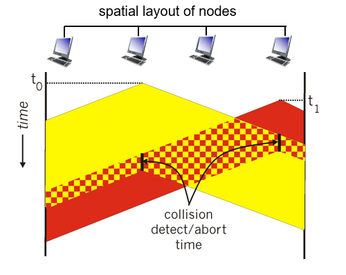

- Carrier Sense Multiple Access (CSMA)
- Simple CSMA
	- 1. Listen before send.
	- 2. If channel busy, defer.
	- 3. If channel idle, send it.
	- **No reliable transmission in link layer: RDT is realized in network layer (e.g. TCP)**
		- So no ACK needed.
- CSMA/CD
	- CD: Collision detection
	- collisions detected within short time
	- colliding transmissions aborted, reducing channel wastage
	- collision detection easy in wired, difficult with wireless
		- Because the node must be able to "hear" when "talk", which is difficult in wireless setting.
	- Ethernet CSMA/CD algorithm
		- 1. NIC receives datagram from network layer, creates new frame.
		- 2. If NIC senses the channel
			- idle: send right away
			- busy: wait until it goes idle
		- 3. If without collision: done.
		- 4. If collision detected: abort, send jam signal.
		- 5. After abort, NIC enters binary back-off
			- After $m$th abort, NIC chooses $K \gets \{0, 1, ..., 2^m-1\}$ randomly
			- It then waits for $K\cdot 512$ bit times, and goes to step 2.
		- Efficiency
			- $\frac{1}{1+5t_{prop}/t_{tran}}$
			- $t_{prop}$: propagation delay.
			- $t_{tran}$: time to transmit max-size frame.
	- **Each frame must be long enough to detect any collision**
		- {:height 254, :width 318}
		- The time for transmission must be long enough to detect collision; that is, longer than 2 maximal RTT.
		- $\frac{L}{R}\geq \frac{2S}{R_{prop}}$, where $S$ is the longest distance.
- CSMA/CA
	- CA: Collision Avoidance
	- DIFS: Distributed Inter-frame Spacing, a fixed constant
	- SIFS: Short Inter-frame Spacing
	- Sender:
		- if senses channel idle for DIFS, then transmit entire frame.
			- **And do not wait for ACK.**
		- if senses channel busy
			- Exponential back-off: the timer starts after DIFS, and is frozen when the channel busy
			- When the timer goes to zero, transmits entire frame and **wait for ACK.**
	- Receiver
		- if frame received ok, returns ACK after SIFS.
	- Optional
		- RTS (Request-to-send) and CTS(Clear-to-send)
		- The sender first sends RTS, and waits for its CTS.
		- If sender receives CTS that is not its, it waits till it receives ACK.
		- This is used to solve hidden terminal problem.
		- It's optimal: if the sender's gonna send a very long frame, it can use this to "probe" first.
		-