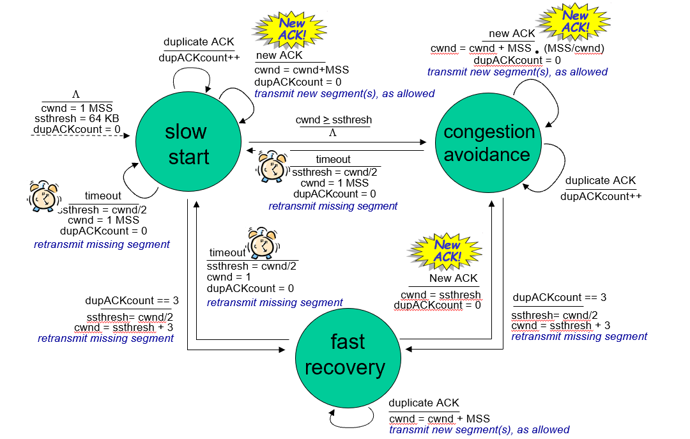

- Principle: Additive Increase Multiplicative Decrease (AIMD)
- Congestion window: $cwnd$ (a new "window" in addition to $rwnd$)
- Routine
	- 0. Initially, $cwnd=1$ MSS (maximum segment size), $ssthresh=64$KB
		- goes to **Slow start**
	- 1. **Slow start**:
		- $cwnd$ is added $1$MSS for every new ACK.
		- (That is, $cwnd$ is doubled approximately every RTT)
		- on $cwnd\geq ssthresh$
			- goto **Congestion avoidance**
		- on time-out
			- $ssthresh \gets cwnd/2$
			- $cwnd \gets 1$MSS
	- 2. **Congestion avoidance**
		- $cwnd$ increase by $1$MSS when all ACKs ($cwnd$ in total) received
		- on three duplicate ACK
			- $ssthresh\gets cwnd/2$
			- $cwnd\gets ssthresh + 3$MSS ("cut half then add")
			- goto **Fast recovery**
		- on time-out
			- $ssthresh\gets cwnd/2$
			- $cwnd\gets 1$MSS
			- goto **Slow start**
		- **NOTE**
			- in early version of TCP, i.e. TCP Tahoe, it just sets $cwnd\gets 1$MSS$, regardless of duplicate ACK
			- in TCP Reno, there add in a new step (**Fast recovery**) to deal with duplicate ACK
	- 3. **Fast recovery**
		- on duplicate ACK
			- $cwnd \gets cwnd + 1$MSS
		- on new ACK
			- $cwnd\gets ssthresh$
			- goto **Congestion avoidance**
		- on time-out
			- $ssthresh\gets cwnd / 2$
			- $cwnd \gets 1$MSS
			- goto **Slow start**
	- {:height 341, :width 525}
		- This automata is ridiculous... Full of errors, none sense of beauty...
		- It's just not possible that one could understand this automata without himself already knowing the whole shit a prior.