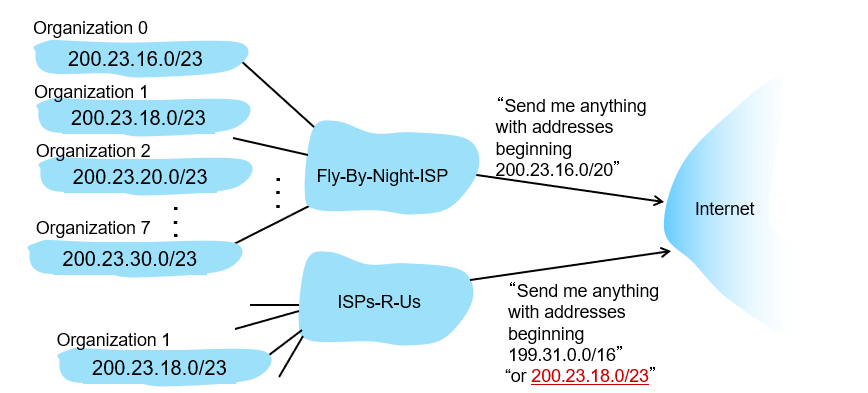
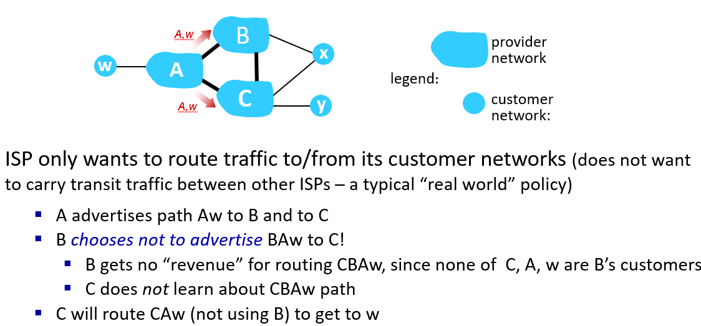

public:: true

- A note for preparing final exam.
- Chapter 1: Introduction
  collapsed:: true
	- access network
		- the network that physically connects an end system to the first router ("edge router") on a path from the end system to any other "distant" end system
		- The word "distant" is very vague, which suggests that this notation is more a conceptual one rather than a technical one.
	- link transmission rate
		- a.k.a. link bandwidth / link capacity
	- guided media / unguided media
	- switching
		- packet-switching
			- store and forward: each packet must fully arrive at the router before it is forwarded
		- circuit-switching
			- Multiplexing (FDM / TDM)
				- Frequency Division Multiplexing (FDM)
				  collapsed:: true
					- Each call allocated a narrowed band
					- 
				- Time Division Multiplexing (TDM)
				  collapsed:: true
					- Each call allocated a periodic time slot
					- 
			- Advantage
				- no loss of packets
				- no queuing delay
				- reliable data transfer
	- "network of networks"
		- Figure
		  collapsed:: true
			- 
		- IXP (Internet Exchange Point)
			- If two region ISPs are physically close, they might (after negotiation) build a IXP instead of flowing through tier-1 ISP.
		- regional ISP may connect access networks to tier-1 ISPs (Zhejiang Telecom -> China Telecom)
		- content provider networks: private network that connects its data centers to Internet, often bypassing tier-1, regional ISPs.
	- Network delay
		- $d = d_{proc} + d_{queue} + d_{tran} + d_{prop}$
		  collapsed:: true
			- processing delay + queuing delay + transmission delay + propagation delay
			- $d_{tran} = \text{packet length (bits) } / \text{ link transmission rate (bps)}$
			- $d_{prop} = \text{physical distance (meters) } / \text{ propagation speed (m/s)}$
		- Traffic intensity
			- $\text{arrival rate of bits } / \text{ transmission rate}$
			- close to 1: queuing delay large
	- Throughput
		- rate of which bits are being sent
		- instantaneous throughput / average throughput
		- bottleneck link
		  collapsed:: true
			- link on an end-end path that constrains end-end throughput
			-
	- Security
		- Authentication
		- Confidentiality
		- Integrity checks
		- Access restriction
		- Firewalls
	- Five-layer model
		- Application Layer
			- responsible for applications' communications
			- more concerned about semantic thing
			- examples: HTTP, IMAP, STP, DNS
		- Transport Layer
			- responsible for processes' communications
			- examples: TCP, UDP
		- Network Layer
			- responsible for routing, and send message host-to-host
			- the layer where router works
			- examples: IP, routing protocol
		- Link Layer
			- responsible for transmission between a link
			- the layer where switcher works
			- IP unavailable; MAC for addressing
			- examples: Ethernet, 802.11 (Wi-Fi), PPP
		- Physical Layer
			- physically encoding / decoding
- Chapter 2: Application Layer Overview
  collapsed:: true
	- Architecture for application
		- Client-server architecture
			- server
				- an always-on host
				- with fixed IP address (for client to find)
				- usually in datacenter
			- client
				- interact with server
				- connect (and then disconnect) from time to time
				- may have dynamic IP address
				- not connected to other clients directly
			- examples: HTTP, IMAP (Internet Message Access Protocol), FTP
		- Peer-to-peer Architecture
			- no always-on server
			- hosts connect to each other directly
			- peer gets service from other peer, and also provides service
	- Process communication
		- client process: the one that initiates the communication
		- identifier: IP address + port number
		- "port" is conceptual: you can NOT find it in hardware
	- What does an application layer protocol define
		- 1. types of messages exchanged
			- e.g. request, response
		- 2. message syntax
			- the structure of a message
		- 3. message semantics
		- 4. rules
	- What transport service may an app need
		- Reliable data transfer
			- e.g. FTP needs 100% accuracy, while some real-time audio apps tolerates loss
		- Timing
			- e.g. telephony, interactive game
		- Throughput
			- e.g. multi-media
		- Security
	- HTTP
		- HTTP response time (per object)
			- 1 RTT for initiate TCP connection
			- 1 RTT for request / transmitting back (i.e. some network delays)
			- Extra time for transmitting objects
			- Round Trip Time (RTT): time for a small packet to travel from client to server and back
		- non-persistent HTTP
			- each TCP connection is closed after one object is transmitted
			- requires 2 RTT per object
		- persistent HTTP
			- TCP connection is maintained until the client has no more object to request for
		- stateless: server do not record the state / requests of clients
		- Cookies
			- If the server is willing to record your browse state, it can assign a unique ID to you (Cookies)
			- The server records your info into database.
			- You can attach Cookies to your request, so the server knows your browse state.
		- HTTP response status code
			- 
		- Web caches (aka proxy servers)
			- works both as client and server
			- Why web caching
				- reduce responding time
				- reduce network traffic
			- use condition GET: "If modified since ..."
				- get "304 not modified" if not modified
				- otherwise get a a new web page
			- Hit rate: the fraction of requests served by cache
	- E-mail
		- SMTP is used to deliver email from user's agent to mail server, and from mail server to another mail server
		- POP3 / IMAP is used to download email from mail server.
	- Domain name system (DNS)
		- to translate a domain name to its IP address
		- runs in application layer
		- Service
			- alias name
				- beside canonical domain name, a service may have some alias names
			- load balance
				- several IP address correspond to a same domain name
				- thus, requests can be allocated to many server
		- Structure
			- 
				- There are 13 logical root servers, with many copies.
			- Client first asks root DNS server for .com DNS server
			- Then ask .com DNS server for yahoo.com DNS server
			- Authoritative server can be maintained by organization/service provider, and returns target IP
		- Local DNS server
			- caches some name-to-IP pairs
			- helps local hosts to send request for DNS service
			- do NOT belong to the 3-level hierarchy
			- Iterated query
			  collapsed:: true
				- 
			- Recursive query
			  collapsed:: true
				- 
				- Not realistic
				- Can be required by setting flag bit (but usually refused by server in 3-level hierarchy)
		- DNS record
			- distributed database storing resource records (RR)
			- RR format: (name, value, type, ttl)
			- type = A
				- name is hostname
				- value is IP address
			- type = NS
				- name is domain (e.g., foo.com)
				- value is hostname of the authoritative name server for this domain
			- type = CNAME
				- name is a alias name for some canonical names
				- value is its canonical name
			- type = MX
				- name is a mail service's name
				- value is the SMTP mail server associated with that name
	- Client-server vs P2P
		- consider distribute a file of size $F$ in a network
		- client-server
			- $D_{cs} \geq \max \{NF/u_s, F/d_i\}$
			- $NF/u_s$ is the time for the server to transmit all files copies
			- $F/d_i$ is the time for each user to download
			- grow linearly w.r.t $N$
		- P2P
			- $D_{P2P} \geq \max\{F/u_s, F/d_{min}, NF/(u_s + \sum u_i)\}$
			- $F/u_s$ is the time for the source to upload the file
			- $F/d_{min}$ is the time for the slowest peer to download
			- $NF/(u_s + \sum u_i)$ because the file must be uploaded for at least $N$ times
		- 
	- BitTorrent
		- file divided into 256KB chunks
		- Requesting chunks
			- periodically, a peer asks each peers for list of chunks that they have
			- it requires the missing chunks from other peers, rarest first
		- Sending chunks
			- peer sends chunks to those 4 peers that are current sending at highest speed to it
				- other peers are choked by it: will not receive any chunks from it
			- re-evaluate top-4 peers every 10sec
			- every 30sec, it randomly chooses a peer and sends chunks
				- so new comers would have chunk to send, and then may become some peers' top-4 peer
	- Video streaming and CDNs
		- Coding
			- spatial redundancy: within one image, nearby pixels are close in color to each other
			- temporal redundancy: between one frame and next
			- CBR: constant bit rate
			- VBR: variable bit rate; video encoding depends on the spatial and temporal redundancy
		- Challenges
			- huge number of users
			- the server-to-client bandwidth varies over time
			- packet may loss, or arrive in wrong order
			- client-interactivity: pause, fast-forward, rewind, jump
		- DASH: Dynamic Adaptive Streaming over HTTP
			- server:
				- divides video file into multiple chunks
				- each chunk encoded at multiple different rates
				- different rate encodings stored in different files
				- files replicated in various CDN nodes
				- manifest file: provides URLs for different chunks
					- manifest file contains several servers that are close to the client
			- client:
				- periodically estimates server-to-client bandwidth
				- consulting manifest, requests one chunk at a time
				- chooses maximum coding rate sustainable given current bandwidth
				- can choose different coding rates at different points in time (depending on available bandwidth at time), and from different servers
			- client decides
				- when to send a chunk
				- what the encoding rate should be
				- where to request a chunk
			- Streaming video = encoding + DASH + playout buffering
		- CDN: Content Distribution Networks
			- use several servers located at geographically different locations
			- enter deep: push CND server deep *into* many access networks
			- bring home: put a few server close to access network
			- authoritative DNS returns CNAME with another authoritative DNS, who actually is in charge of storing and delivering the content
			- 
			-
- Chapter 3: Transport Layer Overview
  collapsed:: true
	- Targets
		- multiplexing, demultiplexing
		- reliable data transfer
		- flow control
		- congestion control
		- provide logical communication between processes
			- applications -> processes -> hosts -> neighbors -> links
	- The "packet" in this layer is called segment (段)
	- Multiplexing, demultiplexing
		- All messages sent/received by all processes are delivered by a same program working at transport layer
		- TCP
			- uses (source IP, source port, target IP, target port) value to direct messages to appropriate process
			- Demultiplexing uses (IP, port number).
		- UDP
			- uses (IP, port) to direct messages
			- Demultiplexing uses port number only.
	- UDP - User Datagram Protocol
		- common in streaming video, DNS, SNMP(Simple Network Management Protocol), HTTP3(QUIC)
		- UDP segment
		  collapsed:: true
			- 
		- Checksum
			- 1. cut payload into 16-bit integers
			- 2. one by one, add them up
			- 3. when the addition overflows, add the $1$ (that overflows) to the end of the result
			- 4. lastly, flip all bits
			- Examples: (consider a 4-bit version)
				- sum = $0110+1010+1101 = 0001+1101 = 1110$
				- checksum = 0001
			- To check: the receiver adds the sum of payload to the checksum, the result should be zero.
		- Pluses
			- no hand-shaking (which takes a RTT)
			- can function when network service is compromised
			- helps with reliability (checksum)
	- Reliable Data Transfer (RDT)
		- (here are versions of some stupid and naive protocols which dare try to imitate our glorious TCP with contemptible UDP)
		- RDT 1.0
		  collapsed:: true
			- no bit error, no loss of segment
			- 
		- RDT 2.0
		  collapsed:: true
			- with bit error, no loss of segment
			- 
			- Sender sends and wait for ACK with correct sequence number.
		- RDT 3.0
		  collapsed:: true
			- with bit error, loss of segment
			- Add "time-out" feature.
		- Pipelining
		  collapsed:: true
			- to allow multiple in-flight, but yet-to-be-acknowledged packets
			- Go-Back-N
			  collapsed:: true
				- 
				- Sender consecutively transmit unACKed packets.
				- Receiver **discards** packets that arrive out of order, and sends the lastly accepted packet's sequence number.
				- Sender ignore duplicated ACK.
				- When the oldest in-flight packet times-out, sender **resend all packets in the window** (back N)
				- Example
				  collapsed:: true
					- 
			- Selective Repeat
			  collapsed:: true
				- 
				- Sender
				  collapsed:: true
					- Sender consecutively transmit unACKed packets.
					- Sender's window is continuous, and moves when its left edge are not blocked.
					- **Each packet a timer: when it times-out, resend only that packet and restart timer.**
				- Receiver
				  collapsed:: true
					- Receiver also has a receiving window.
					- The window moves when the lowest packet inside is obtained (just received or already in buffer).
					- Let receiving window be [recvBase, recvBase+N-1]
					- **For packet in [recvBase-N, recvBase+N-1], receiver shall send ACK.**
					- or packet in [recvBase, recvBase+N-1], receiver shall buffer.
					- Otherwise, it ignores.
				- Examples
				  collapsed:: true
					- 
					- No retransmission for 3,4,5: they haven't timed-out yet. (NOT because sender has received their ACKs)
			- Minimum sequence number space for two schemes
			  collapsed:: true
				- Assuming that packets always arrive in order. (otherwise the answer will be $\infty$)
				- Go-Back-N: $N+1$
				  collapsed:: true
					- Firstly, $N$ is not safe.
					- Consider $N+1$. The receiver is always expecting exactly one next packet (e.g. $x$): can it be a wrong packet?
					- Note that only if sender receives previous $x-N$ ACK, will it send that expected packet.
					- If sender receives $x-N$ ACK, it sends exactly that correct packet; otherwise it will never (as constrained by window size) be able to send $x$ (when it resends some packets).
					- If it cannot send $x$, since $x-N, ..., x-1$ have arrived, there is no in-flight $x$.
					- Thus, the receiver is always expecting the correct packets, and receiving that correct one.
				- Selective Repeat: $2N$
				  collapsed:: true
					- Consider the worst case.
					- The sender sends $1, ..., N$, and receiver receives them all.
					- Yet the receiver's ACKs are all lost, somehow.
					- In this condition, the sending window and receiving window are at largest distance.
					- The receiver is expecting $N+1, ..., 2N$ now.
					- The sender decides again to send $1, ..., N$. So we must keep $1$ out of receiving window.
					- Which means that the sequence number must be able to hold $2N$, instead of  wrapping it to $1$.
					- So $2N$ be.
	- TCP
		- Segment structure
			- 
			-
			- Note that both TCP and UDP segment contains NOT IP information, for that they will be encapsulated into IP datagram which contains IP.
			- Sequence number here is number of next first **byte**. Remember that RDT uses the number of packet.
			- ACK number is the **next expected seq number**
			- (I have to say the RDT things simply makes all concepts a mass)
		- Time-out
			- (about how to set time-out value)
			- SampledRTT: measured time from sending the segment to receiving its ACK. (ignore retransmission)
			- EstimatedRTT = $(1-\alpha)$ EstimatedRTT + $\alpha$ SampledRTT
				- Typically $\alpha = 0.125$
			- DevRTT = $(1-\beta)$ DevRTT  + $\beta$|SampleRTT-EstimatedRTT|
				- EWMA (Exponentially weighted moving average)
				- EWMA of SampledRTT deviation from EstimatedRTT
				- Typically $\beta = 0.25$
			- TimeoutInterval = EstimatedRTT + $4*$DevRtt
			- (Some stupid formulas that are probably just experiential)
		- Fast retransmit
			- On receiving three additional ACK seq number: retransmit the packet containing that byte immediately.
			- That is, "receiving the same ACK for four times" in total.
			- Examples
			  collapsed:: true
				- 
		- Retransmit behavior
			- TCP uses Go-Back-No or Selective Repeat
			- It depends on the two sides of the connection.
			- If Selective Acknowledgement (SACK) is enabled/implemented.
		- Examples on sending segments
		  collapsed:: true
			- 
			-
		- Flow control
			- The receiver tells the sender current size of free buffer
				- {:height 167, :width 188}
			- The sender makes sure the in-flight data never overflows $rwnd$
			- $inflight = LastBytesSent - LastByteAcked$
			- For sender: $LastByteSent - LastByteAcked \leq rwnd$
		- 3-way handshake
			- 1: Client -> Server
			- 2: Server -> Client (Client side established)
			- 3: Client -> Server (Server side established)
			- In the third time, the client can send message directly.
			- So in total it takes exactly $1$ RTT to establish connection.
			- What is establishment: to allocate system resource for the connection.
			- 2-way handshake vs 3-way handshake
			  collapsed:: true
				- 
		- 4-way handshave
			- {:height 271, :width 469}
			- The client waits for extra time to ensure that the server receives the FIN, so the server can free its resource as soon as possible.
		- Congestion control
			- basically two ways: end-end or network-assisted
			- [[TCP congestion control]]
			- Formula for throughput of TCP Reno
				- TCP throughput = $\frac{1.22\text{MSS}}{\text{RTT}\sqrt{L}}$
				- where $L$ is the rate for packet loss
		- TCP fairness
			- Fairness: if there are $T$ connections over a  link with bandwidth $R$, then each connection should share a bandwidth of $R/T$.
			- 
- Chapter 4: Network Layer - Data Plane
  collapsed:: true
	- Network layer functions
		- 1. **forwarding**: move packets from a router’s input link to appropriate router output link
		  2. **routing:** determine route taken by packets from source to destination
		- Data plane: forward packet according to forwarding table
		- Control plane: help router to build forwarding table
	- router
		- Responsibility
			- Examines fields of all IP datagram passing through it.
			- Moves datagram from input port to output port to transfer datagram along end-end path.
		- High-level architecture
			- 
			- Control plane (upper part)
				- Realized via software, for flexibility.
				- Responsible for running routing algorithm.
				- Download forwarding table. (in SDN, software-defined networking)
			- Data plane (lower part)
				- Realized via hardware, for efficiency.
				- Forward packet as instructed by forwarding table.
			- Input port
				- 
				- The structure of output port is approximately its reverse.
				- Destination-based forwarding: consider only target IP address
				- Generalized forwarding: may consider any header field values
		- Forwarding table
			- 
			- Use **longest prefix matching**.
			- Often performed using ternary content addressable memories (TCAMs, 三重内容寻址内存), which simultaneously matches input to all expression: 0 / 1 / not care.
		- Switching fabric
			- 
			- Moves datagram from input port to output port.
			- Via memory: often too slow.
			  collapsed:: true
				- speed limited by memory bandwidth (a system bus is in charge of moving datagram from input port -> memory -> output port)
				- 
			- Via bus: can move one datagram from input port to output port at same time.
			- Via interconnection network: as long as the input/output port do not coincide, the datagrams can be transmitted simultaneously.
		- Input port queuing
			- Packet from all input ports are coming at rate higher faster than fabric switching
			- Head-of-the-line(HOL) blocking: output port is occupied by other packet, so some packets have to wait.
		- Output port queuing
			- 
			- Buffer needed when packet from switch fabric arriving faster than link transmission rate.
		- How much buffering?
			- Too much buffer would increase delay, since TCP literally tries to fill it...
			- It is suggested to be of size $\frac{\text{RTT}\cdot C}{\sqrt{N}}$
			- $C$ is link capacity/bandwidth, $N$ is number of input port.
		- Buffer management
			- Drop policy: which packet to drop when the buffer is full?
				- tail drop: drop the arriving one
				- priority
			- Scheduling discipline: which packet in queue to transmit first?
				- *It's not clear* ***which*** *buffer is this "scheduling" trick applied. Perhaps both buffer could be applied to.*
				- First Come First Served (FCFS) / First In First Out (FIFO)
				- Priority Scheduling
					- Partition packets into different priority according to header info.
					- Deal with the packet with highest priority first.
				- Round Robin (RR)
					- Multiple queues, separated according to header info.
					- Scan each queue cyclically and repeatedly, gives the queue in turn a same time interval to process.
					- {:height 219, :width 427}
				- Weighted Fair Queue (WFQ)
					- Generalized RR.
					- Given each queue a different weight, and allocate time interval to this queue accordingly.
					- Minimum bandwidth guarantee for each queue. (by its weight)
	- the Internet Protocol (IP)
		- IP datagram
			- 
			- The datagram could be separated into several fragments. 16-bit identifier is used to identify which fragment is this.
			- The header checksum is the checksum for the header. The payload data is (typically) a TCP/UDP segment, so it will have its own checksum.
			- "options" is optional: if there is none, the payload data starts there right away.
			- Why fragmenting
				- Datagram passes through various network, some of which might have constraint on maximum "packet" length.
					- MTU: Maximum Transmission Unit
				- So, to push the datagram into lower network, router might fragment it first.
				- Usually it is when fragments reach their destination that they be pieced together.
				- Example
					- Consider a datagram of $4000$B entering a network with MTU being $1500$B.
					- The datagram: 20B header + 3980B payload, with ID = x.
					- It will be cut into three fragments:
					  | length | ID | fragflag | offset |
					  | ------ | --- | ------- | ------ |
					  |1500B|x|1|0|
					  |1500B|x|1|185|
					  |1040B|x|0|370|
					- Offset is "per eight Bytes" (**not per 8 bits**)
					- Each fragment, except the last one, its length must be multiple of $8$B.
						- The key is the, flag "length of payload" is $16$bits, but "fragment offset" is only $13$bits.
						- Ref: [Stack overflow: Why the ip fragments must be in multiples of 8 bytes](https://stackoverflow.com/questions/7846442/why-the-ip-fragments-must-be-in-multiples-of-8-bytes)
		- Subnet
			- Interface: connection between host/router and physical link
				- Do not wander why interfaces are actually connected. It's the concern of lower layer.
				- {:height 293, :width 369}
			- Subnet: **device interfaces** that can physically reach each other without passing through an intervening router. (marked blue in above figure)
				- {:height 226, :width 380}
				- **Note**: The link between two router is a subnet. (in above pic)
			- IP address structure
				- Subnet part: the interfaces in the same subnet share a same high order bits (in pic, 223.1.1)
				- Host part: remaining low order bits.
				- Subnet mask: set all subnet part to 1, host part 0.
					- E.g. 223.1.9.0/24 -> 11111111 11111111 11111111 00000000
			- Classless Inter-domain Routing (CIDR)
				- The length of subnet part of an IP is not fixed.
				- A subnet be express as "a.b.c.d/x", where x is length of its subnet part.
				- E.g., "223.1.1.0/24" is a subnet in above pic. (the host part is denoted zero)
			- Dynamic Host Configuration Protocol (DHCP)
				- To help host in a subnet get its own IP.
				- Process
				  collapsed:: true
					- The host broadcasts DHCP discover message. [optional]
					- The **DHCP server** responds with DHCP offer message, with a available IP address. [optional]
					- The host requests IP address by broadcasting DHCP request message.
					- The DHCP server broadcasts an ACK.
					- **Note**
					  collapsed:: true
						- the first two steps can be skipped if the host remembers and wishes to reuse a previously allocated network address.
						- Broadcasting: In IP datagram, fill the target IP with "255.255.255.255", and source IP with "0.0.0.0" (which indicates that it has no address yet)
						- The broadcast would be heard by everyone in the subnet, but not out of it.
						- All steps are done by broadcasting, so every member of this subnet knows this event.
				- The DHCP server can also return some useful info to help the new comer set up
				  collapsed:: true
					- (Contained in the ACK packet from DHCP server)
					- address of first-hop router for client
					- name and IP address of DNS sever
					- network mask (indicating network versus host portion of address)
				- How does DHCP server get the subnet IP address?
				  collapsed:: true
					- It gets allocated portion of its provider ISP’s address space
			- About longest prefix matching
			  collapsed:: true
				- 
				- When organization 1 moves from fly-by-night-ISP to ISPs-R-Us, it needs not to assign to its hosts with new IP addresses.
				-
		- IP allocation
			- Host gets IP from DHCP server
			- DHCP server gets a block of IP from its ISP
			- ISP gets a block of IP from RR (regional registries)
			- RR gets a block of IP from ICANN (Internet Corporation for Assigned  Names and Numbers)
			- ICANN owns the IP addresses.
			- There are in total 5 RRs.
		- NAT: Network Address Translation
			- {:height 186, :width 527}
			- All datagrams leaving / entering local network shares a same IP. (e.g. 138.76.29.7)
			- All devices in local network have 32-bit addresses in a “private” IP address space that can only be used in local network
			- The special IP preserved as "private"
				- 10.0.0.0/8
				- 172.16.0.0/12
				- 192.168.0.0/16
			- Why bothers
				- Help save IP: only one is needed for the entire local network
				- can change addresses of host in local network without notifying outside world (inside)
				- can change ISP without changing addresses of devices in local network (outside)
				- security: devices inside local net not directly addressable, visible by outside world
			- How is it done
				- Outgoing datagram: replace its (source IP, port) with (NAT IP, new port).
				- Incoming datagram: translate (NAT IP, new port) back to (source IP, port).
			- Controversy
				- Inefficiency.
				- Address “shortage” should be solved by IPv6
				- Violates end-to-end argument (port manipulation by network-layer device)
				- NAT traversal: what if client wants to connect to server behind NAT? (P2P)
		- IPv6
			- Motivation
				- IPv4 exhausted.
				- speed processing/forwarding: 40-byte fixed length header
			- Datagram
				- {:height 246, :width 686}
				- No checksum: speed processing / this should be done in lower layer.
				- No fragmentation
					- PTMTU protocol acquires the minimum MTU in the path.
					- Also, the network supporting IPv6 must satisfy a lower-bound of MTU.
			- Tunneling
				- Not all network can be upgraded to support IPv6
				- When the packet will enter a network not supporting IPv6
					- Make IPv6 datagram be carried as payload of an IPv4 datagram.
					- In the IPv4 tunnel, the source and destination are rewritten.
					- {:height 288, :width 477}
					-
- Chapter 5: Network Layer - Control Plane
  collapsed:: true
	- Dijkstra’s link-state routing algorithm
	  collapsed:: true
		- Each router broadcasts its link state information to other router
		  collapsed:: true
			- With appropriate implementation, its overall complexity is $O(n)$.
		- Then each router runs Dijkstra algorithm itself.
		- Oscillation
		  collapsed:: true
			- When link costs depend on traffic volume, route oscillations possible.
			- That is, all traffic are directed to a same link, its link cost grows rapidly; then directed to another, and the old link becomes optimal again, ...
			- How to deal with:
			  collapsed:: true
				- Do NOT update synchronously
				- Instead, each router updates with a random frequency
	- Distance Vector Algorithm
	  collapsed:: true
		- Based on Bellman-Ford equality: $d(x,y)=\min_{v\in N(x)} \{c_{x,v} + d(v,y)\}$
		- Each router tells its link state to its neighbor
		- Each router updates according to the equality.
		  If shorter path found to any node, it tells this to its neighbor.
		- Each router updates asynchronously for multiple rounds.
		- If the network is stable, each router will converge to an optimal "distance vector".
		- "Good news travels fast" "Bad news travels slow"
		  collapsed:: true
			- If the cost of one link goes small, soon everyone knows.
			- {:height 122, :width 179}
			- Firstly, y thought that z has a path to x with cost 5 (by z->y->x).
			- So y suggests its distance to x is 6.
			- Then z suggests its distance to x is 7.
			- ...
			- It takes many rounds for z to realize that the current optimal path to x is z->x. So does y.
	- Make routing scalable
	  collapsed:: true
		- Why above scheme too idealized:
		  collapsed:: true
			- In real Internet, their are billions of devices.
			  collapsed:: true
				- Can't store these info + exchanging info swamps links
			- Administrative autonomy
			  collapsed:: true
				- Routers might want to control its traffic (direct it in a way that maximizes its profit)
		- Aggregate routers into regions known as “autonomous systems” (AS) (aka "domains")
		- Intra-AS (域内路由)
		  collapsed:: true
			- All routers must run the same intra-domain protocol
			- Gateway router: at “edge” of its own AS, has link(s) to router(s) in other AS’es
		- Inter-AS (域间路由)
		  collapsed:: true
			- 
			- OSPF
			  collapsed:: true
				- Open: public available, not proprietary
				- Classic link-state routing: each router has full topology, and runs Dijkstra
				- Security: all OSPF message authenticated
			- BGP (Border Gateway Protocol)
			  collapsed:: true
				- the de facto inter-domain routing protocol
				- BGP session: two BGP routers (“peers”) exchange BGP messages over semi-permanent TCP connection
				  collapsed:: true
					- 
				- BGP route selection:
				  collapsed:: true
					- (how an AS select its nearby AS to transmit a datagram)
					- 1. To each AS, it has a preference.
					- 2. If not 1, then it tries the shortest AS-path.
					- 3. If 2 ties, then it tries the one that gets out of itself fastest. (Hot potato)
					- 4. Some more criteria possible.
			- 
	- ICMP: Internet Control Message Protocol
	  collapsed:: true
		- Helps host exchange information about network layer with router.
		- Basic function
		  collapsed:: true
			- error reporting: unreachable host, network, port, protocol
			- echo request/reply (used by ping)
		- The ICMP message is carried in IP datagram.
		  collapsed:: true
			- ICMP message: type, code plus first 8 bytes of IP datagram causing error
			- {:height 225, :width 214}
		- Traceroute
		  collapsed:: true
			- Send UDP segment with TTL=1, 2,... to the destination, to a randomly chosen port (probably not open at that side).
			- Check each returned datagram:
			  collapsed:: true
				- type 11: TTL expired
				- possibly included the router's name + IP address
				- If the segment reached the host, type 3 code 3: dest port unreachable
				  Then record RTT.
		-
- Chapter 6: Link Layer
	- In this chapter:
		- Hosts and routers are viewed as "nodes".
		- Layer-2 packet: data frame.
		- Framing: add header and tailer to a datagram to make it a frame.
	- Link layer is implemented in network interface card (NIC, 网卡) or on a chip.
	- Error detection
		- EDC: Error detection and correction
		- Parity checking
			- Even parity: to make there in total an even number of 1.
			- {:height 307, :width 594}
			- In the pic, two-dim parity is not correct; d_{4,1} should be 0.
		- Cyclic Redundancy Check (CRC)
			- Given data bits D (viewed as binary number).
			- Given a generator G of $r+1$ bits, with its significant bit being 1.
			- Calculate the remainder of D mod G, under $+_2$ (i.e. xor)
			- The remainder is supposed to have $r$ bits (with leading zero), is used as EDC bits.
			- {:height 234, :width 597}
	- Multiple access links, protocols
		- Two types of link
			- point-to-point
				- point-to-point link between Ethernet switch, host
				- PPP for dial-up access
			- broadcast (shared wire or medium)
				- old-fashioned Ethernet
				- upstream HFC in cable-based access network
				- 802.11 wireless LAN, 4G/4G. satellite
		- Multiple access protocol
			- What is it
			  collapsed:: true
				- distributed algorithm that determines how nodes share channel, i.e., determine when node can transmit
				- communication about channel sharing must use channel itself
			- Idealized goal
			  collapsed:: true
				- When only one node wants to transmit, it transmit at rate $R$ (full)
				- When $N$ nodes wants, at rate $R/N$
				- Fully decentralized
				  collapsed:: true
					- No special node to coordinate
					- No synchronization of clock, slot.
				- Simple
			- Three broad classes of multiple access protocols
			  collapsed:: true
				- channel partitioning
				  collapsed:: true
					- divide channel into smaller “pieces” (time slots, frequency, code)
					- allocate piece to node for exclusive use
				- random access
				  collapsed:: true
					- channel not divided, allow collisions
					- “recover” from collisions
				- “taking turns”
				  collapsed:: true
					- nodes take turns, but nodes with more to send can take longer turns
			- Channel partitioning protocol
				- Time division multiple access (TDMA)
				  collapsed:: true
					- Access to channel in "rounds".
					- Each station gets fixed length of slot in each round.
					- Unused slot goes idle.
					- {:height 101, :width 529}
				- Frequency division multiple access (FDMA)
				  collapsed:: true
					- Divided into different bands.
					- {:height 174, :width 540}
					-
			- Random access protocol
			  collapsed:: true
				- feature
					- full-power sending
					- no a prior coordination
				- [[MAC protocol ALOHA]]
				- [[Carrier Sense Multiple Access]]
				- Taking turns MAC protocol
					- Polling 轮询
						- Muster node invites other nodes to transmit in turn.
						- "Do you have something to say?"
					- Token passing
						- Control token passed from one node to next sequentially.
						- Concern
							- token overhead
							- latency
							- one point of failure (token lost)
	- MAC address
		- WTF is LAN?
			- Roughly, gateway separates LANs, and router separates subnets.
			- For example, school is a LAN, each department in it a subnet.
			- 
			- c.f. [here](https://www.youtube.com/watch?v=NyZWSvSj8ek)
		- Function
			- "Link layer version of IP address".
			- For addressing in the same LAN, link layer.
			- Also named LAN / physical / Ethernet address
		- 48 bit
			- Often express as twelve hexadecimal number
			- e.g. 1A-2F-BB-76-09-AD
		- Allocation
			- MAC address administered by IEEE.
			- Manufacturer buys portion of MAC space from IEEE to ensure uniqueness.
		- Address resolution protocol (ARP)
			- Translate IP to MAC.