public:: true

- 简单的考点整理
	- **略去了一些应该不考的东西**
	- ~~**如果全考还怎么玩啊概念这么多这么杂**~~
- 实体-联系模型（Entity-Relationship, E-R）
  collapsed:: true
	- 核心概念：实体，属性，联系
	- 实体用方框，属性用圆圈，联系用菱形表示
	- 属性有实体的，也有联系上的
	- EE-R：扩展的实体-联系模型
		- 弱实体：若实体A的存在依赖于其他某个实体的存在，称为弱实体
			- 如“学校学生数据库”中，“家属”是依赖于“学生”的弱实体
			- 以 ”学生（实体） <- 是...家属（联系）<- 家属（实体）“描述
	- 属性划分
		- 1. 标识符 (Identifier)
			- 即ID，是属性的集合(set of attributes)
			- 不同实体的ID一定不同
			- 可能有多个，但有（由设计者指定的）主标识符 (primary ID)
		- 2. 描述符 (Descriptor)
			- 非ID的属性，用以描述实体或联系
		- 3. 单值属性
			- 只能在其定义域上取一个值，如“性别”
		- 4. 组合属性
			- 多个单值属性的组合，如“姓名(属性)”有两个属性，姓和名
		- 5. 多值属性
			- 能在定义域上取多个值，如“爱好”
	- 属性基数
		- 可以用二元组$(x,y)$，描述一个实体在一个属性上的数量特征
		- $x=0/1$: 这一属性是否可为空值，0为可，1为必须有值
		- $y=1/$N: 这一属性是否可为多值，N为可，1为必须为单值
		- （“有什么用呢？”——考试设计模型、画图时标上）
	- 实体在联系中的参与基数
		- min-card(E, R)=0/1: 实体在关系中最少出现次数
			- 0：可选参与
			- 1：强制参与
		- max-card(E, R)=1/N: 实体在关系中最多可出现次数
			- 1：单值参与
			- N：多值参与
		- 如果你考虑关系是一条边，ER是二分图的两个部，其中若干的点是实体
		  那么min-card(E,R)是对E中点度数的下界，max-card是上界。
	- 来一个big example
	  collapsed:: true
		- 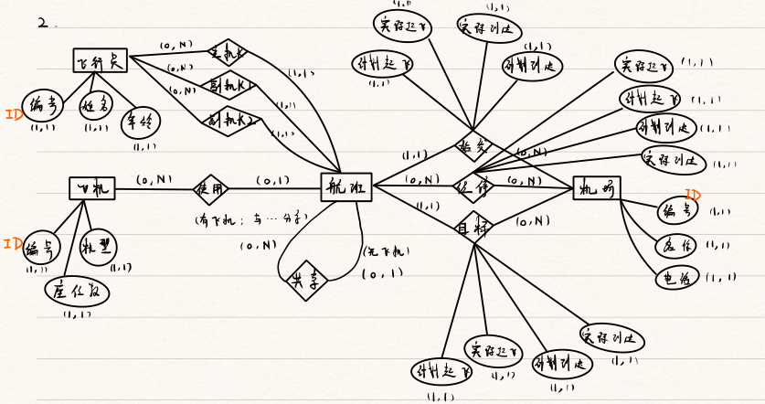
- 关系数据结构
	- 表、关系
		- 其实是一个玩意
		- “关系模式”是“关系”的（形而上的）限制比如“要求属性A+B必须为1”
			- 不保证这个理解是对的，但好像是这么回事
		- 关系则是具体的一张表
		- 每一列叫一个属性，每一行叫一个元组（除去第一行为表框架Table frame/表头 Table heading）
	- 关键字
		- 定义：能**唯一最小**标识元组的属性集
		- 并非组成成分，只是理论上存在之物。
		- 也叫候选关键字；因为主关键字可以从关键字中任意指定。
		- 外关键字
			- 若表A的一个属性集是表B的关键字，则称其为表A的外关键字
			- 其中表A称引用表，B称被引用表；AB可能是同一个表。
			- 作用似乎是在外连接时；不过（对于考试反正）也没太大用就是了。
	- 表相容 (compatible)
		- 表R与表S相容 <=> head(R)=head(S) 且具有相同语义
- 关系操纵
  collapsed:: true
	- **注意所有运算都是去重的：重复在数据表里时没意义的**
	- 基础运算
		- 赋值运算 $R\coloneqq$ <expression>
			- 用来保存中间结果
			- 在新表中，可以采用“原来表.原来属性”的方法表示属性
				- 如$R(A_1, A_2)$与$S(A_2, A_3)$，$T\coloneqq R\times S$
				- 则可以说$T$中有属性$R.A_1, R.A_2, S.A_2, S.A_3$.
				- 如果需要，可以自然联结而非笛卡尔积，或者再使用投影运算去重$A_2$
			- 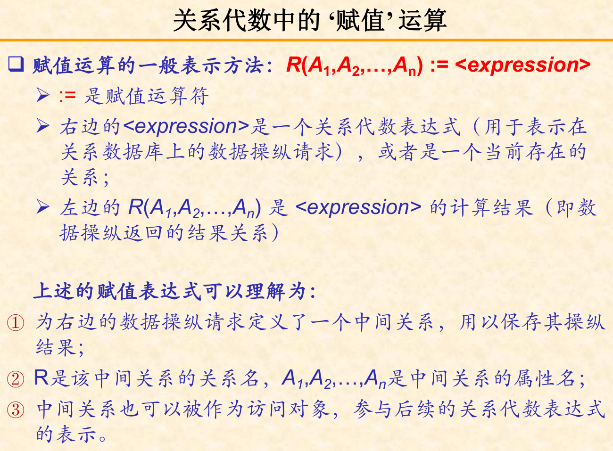{:height 382, :width 496}
		- 选择运算$\sigma_F(R)$
			- 依照条件$F$从$R$中选出满足的元组。
			- $F$的例子如$A_1=A_2\wedge A_3>A_4$
			- 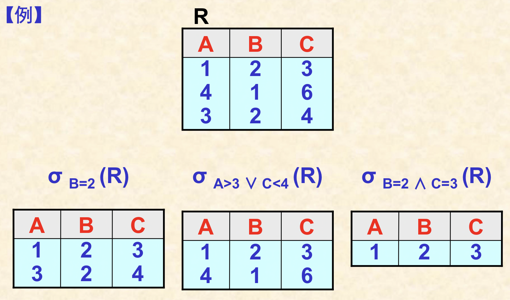{:height 211, :width 348}
		- 投影运算 $\pi_{A_1, ..., A_k}(R)$
			- 选出关系的若干列，构成新关系。
			- （将所有元组投影到这几个属性上）
			- 下标$A_1, ..., A_k$需要为$R$的属性
			- 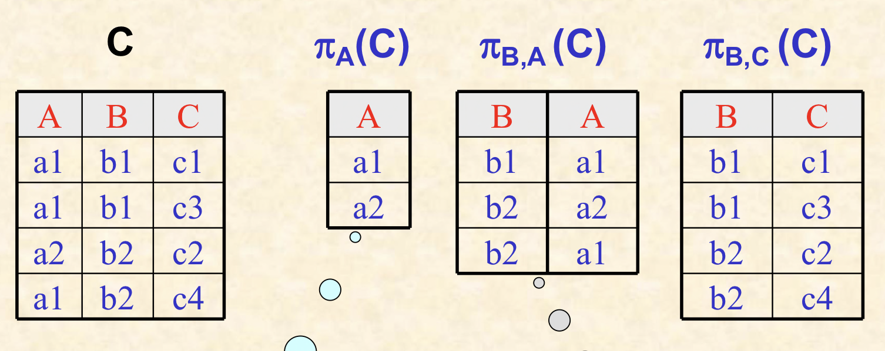{:height 177, :width 421}
		- 笛卡尔积 $R\times S$
			- 将$R$中的所有元组与$S$中所有元组拼接，产生$|R|\cdot |S|$个元组。
			- 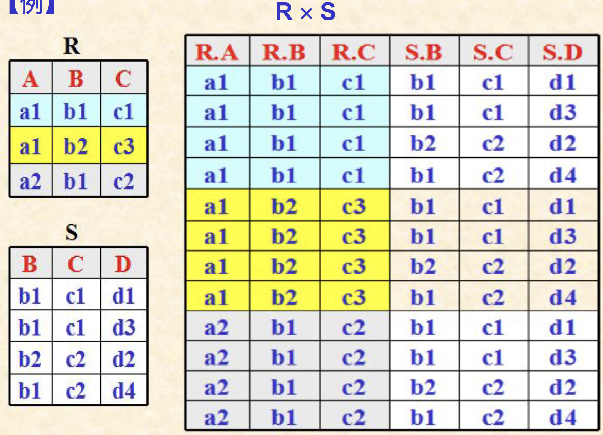{:height 296, :width 425}
		- 并运算 $R\cup S$
			- 要求$R$与$S$是同类关系，也即表框架相同+值域相同
			- 然后合并去重
			- 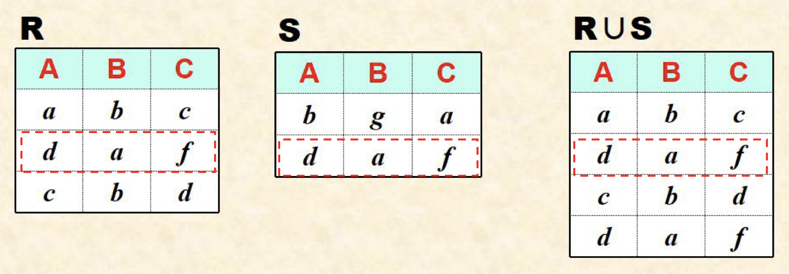{:height 171, :width 431}
		- 差运算 $R-S$
			- 也要求是同类关系
			- 集合的差运算
			- 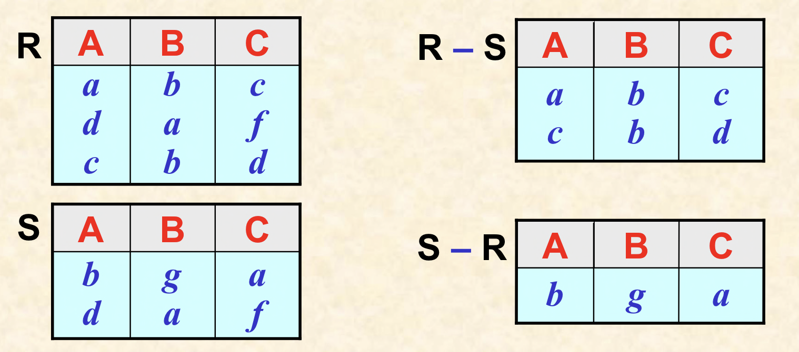{:height 194, :width 433}
	- 扩充运算（均可有基础运算表达）
		- 交运算 $R\cap S$
			- 要求为同类关系
			- 转换：$R\cap S = R-(R-S)$
				- 去除$R$中不属于$S$的部分
			- 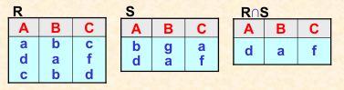{:height 137, :width 427}
		- 联结运算 (Join)
			- \theta-联结运算 $R\underset{F}{\Join} S$
				- 依据关系$F$拼接$R$与$S$中的元组；拼接后加入新表
				- 转换：$\sigma_F(R\times S)$
				- 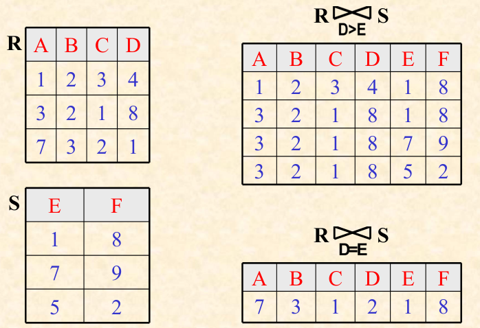{:height 299, :width 412}
			- 自然联接 $R\Join S$
				- 依据两者同名属性拼接
				- 转换
					- 设两者的公共属性为$A_1, ..., A_k$
					- 设两者的属性集之并为$B_1, ..., B_n$，即“所有出现过的属性（去重）”
					- 等价于$\pi_{B_1, ..., B_n}(\sigma_{R.A_1=S.A_1, ..., R.A_k=S.A_k}(R\times S))$
				- 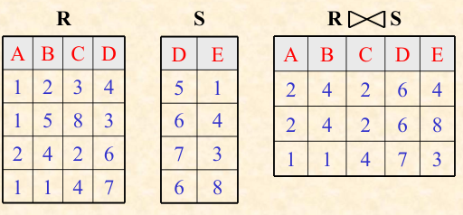{:height 208, :width 432}
			- 外联结
				- 哪边有两杠，则**那边必须全进入结果（如果不存在可行拼接就在另一侧塞空值）**
				- 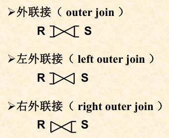{:height 209, :width 242}
				- 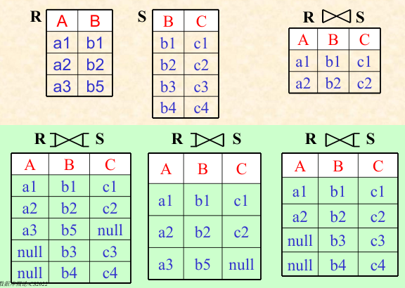{:height 326, :width 428}
		- 除运算 $R/S$
			- $R$中的元组，必须拥有$S$指定的所有属性值，才能被保留。
			- 运算条件：$Head(S)\subset Head(R)$
			- 转换
				- 假设$Head(R)=\{A_1, ..., A_n, B_1, ..., B_k\}$
				- 假设$Head(S) = \{B_1, ..., B_k\}$
				- $R/S = \pi_{A_1, ..., A_n}(R)-\pi_{A_1, ..., A_n}(\pi_{A_1, ..., A_n}(R)\times S- R)$
			- 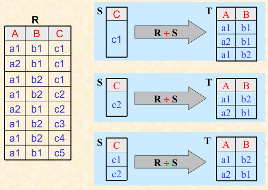{:height 325, :width 433}
- 关系演算（基于谓词）
  collapsed:: true
	- 成真指派/成假指派
		- 成真指派：将变元取值$(v_1, ..., v_n)$代入谓词$P(x_1, ..., x_n)$能使之为真
		  否则称$(v_1, ..., v_n)$是谓词$P$的一个成假指派。
		- 例如$P(x):x$是水果
			- 成真指派：苹果，香蕉
			- 成假指派：汽车，大象，斑马线
	- 认为一个表是一个谓词
		- 对于表$R(A_1, ..., A_n)$
		- $(x_1, ..., x_n)$在表$R$内 <=> 是谓词$R$的一个成真指派
	- 定义：关系演算公式
		- 关系演算原子公式为如下之一
			- 1. 谓词$R(t)$
			- 2. $u(i)\ \theta\ v(j)$，其中$\theta$为$<, \leq, >, \geq, =, \neq$之一
			- 3. $u(i)\ \theta\ a$，其中$a$为常数
		- 关系演算公式为如下之一
			- 1. 原子公式
			- 2. $\varphi_1 \wedge\varphi_2$, $\varphi_1 \vee\varphi_2$, $\varphi_1 \to\varphi_2$, $\neg \varphi_1$, 其中各$\varphi$为公式
			- 3. 若$\varphi$为公式且有自由变元$r$，则$\exists r(\varphi)$, $\forall r(\varphi)$.
			- 4. 公式仅限于此
			- （谓词逻辑）
	- 关系演算中，应当仅有目标属性为自由变元
	- 两种表示方法
		- 元组关系演算 -> 直接使用变量$R(p)$，此时$p$是一个元组；可以用$p(1)$表示其在第一个属性上的取值
		- 域关系演算 -> 使用$R(x_1, ..., x_n)$，显式列出所有变量
		- （推荐使用第二个：第一个得用序号指明属性也太蠢了）
	- 关系操纵的表示
		- $R\cup S=R(p) \vee S(p)$
			- 也可严谨的写作$\{p\ |\ R(p)\wedge S(p) \}$（不过真的有谁会这么做吗？）
			- 或$\{<x_1, ..., x_n>\  |\ R(x_1, ..., x_n)\wedge S(x_1, ..., x_n)\}$
		- $R-S=R(p)\wedge\neg S(p)$
		- $\sigma_F(R)=R(p)\wedge F$
			- 如$F=A_1\wedge A_2$，则$R(p)\wedge (p(A_1)=p(A_2))$
		- $R\times S=R(p)\wedge S(q)$，注意是与操作。
		- $R\underset{F}{\Join} S=R(p)\wedge S(q)\wedge F$
		- $R\Join S=R(x,y)\wedge S(y,z)$，通过（所有的）公共属性/变元来实现自然联接
		- $R/S=\forall y_1, ..., y_m(S(y_1, ..., y_m)\to R(x_1, ..., x_n, y_1, ..., y_m))$
			- 表达式中$x_1, ..., x_n$是（能透到外面来的）的自由变元，因此结果即这些变元的元组们。
	- 示例
		- 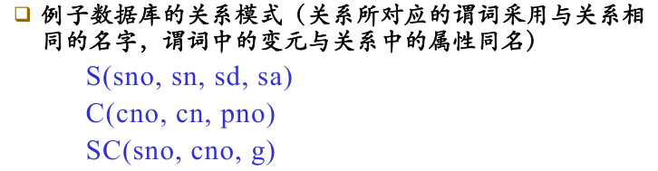{:height 151, :width 518}
		  collapsed:: true
			- S->学生 || C->课程 || SC->选课记录
		- 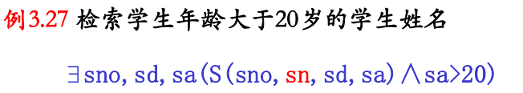{:height 96, :width 512}
		- 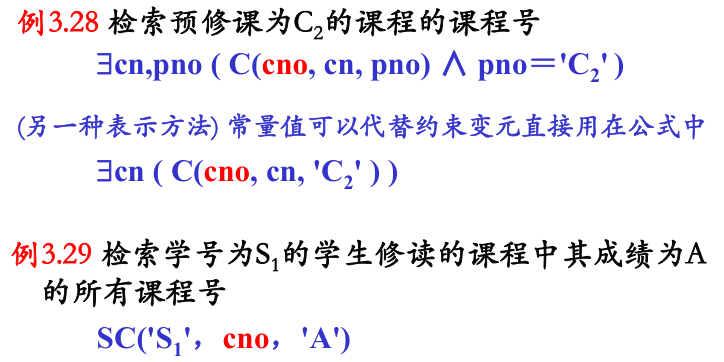{:height 252, :width 515}
		- 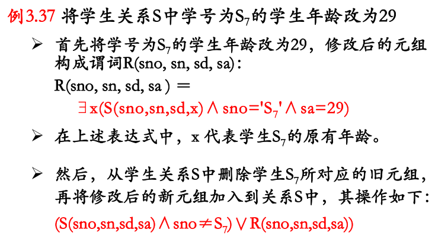{:height 288, :width 518}
		- 更多的示例去看自己的作业
- SQL: Structed Query Language
  collapsed:: true
	- 术语
	  collapsed:: true
		- 基表 (base table)，即关系数据库中的关系；即表。
		- 视图 (view)，即关系子模式，也称虚表
		- 列：属性
		- 行：元组
	- 基本规范
	  collapsed:: true
		- 语句由动词开始，分号结束
		- 使用西文，不区分大小写
		- 数值常量不需要定界符，但字符串、日期等需要单引号标记
	- 数据操纵
	  collapsed:: true
		- 总的命令格式
			- SELECT [DISTINCT] column name list, expression
			  FROM R
			  [WHERE F]
			  [[GROUP BY B_1, ..., B_n]
			  [HAVING gourp_condition]]
			  [ORDER BY C_1[ASC | DESC], C_2[ASC | DESC], ...]
			  涉及多表的时候，可以用"table.column"来指明是哪个表的列
			- 总的处理方法
				- 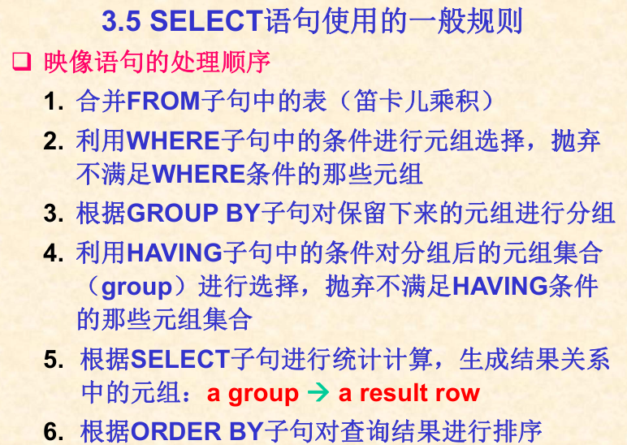{:height 357, :width 485}
			- 目标子句 SELECT，将选中的数据表投影到$\pi_{A_1, ..., A_m}()$
				- DISTINCT 指明需要去重（虽然理论上应该自动去重，但为了效率考虑……）
				- 除了指定列名进行投影外，还可以给入表达式，让它对对应属性做表达式后再塞进结果
				- 可以用星号(*)代表表中所有列名
				- 可以对结果重命名：<column expression> AS <colname>
			- 范围子句 FROM，指定访问哪个关系；**若多个（以逗号分隔）则自动作笛卡尔积**
				- 别名：<table name> [AS] <alias name>，AS可以省略
				- 比如你可能希望引用一个表两次
				- 如果在本次操作中对表进行了换名，则只能使用新名
			- 条件子句 WHERE，F为条件，指定选择元组的条件$\sigma_F()$
				- F中可以使用布尔表达式，即AND OR NOT
			- 分组子句 GROUP BY，分组（见后）
				- 分组查询子句 HAVING
			- 排序输出子句 ORDER BY COL [ASC | DESC]
				- 可以选择按多列的值排序，并为每列依次指定升/降序
				- Ascending / Descending
				- 缺省为升序
				- 例
					- 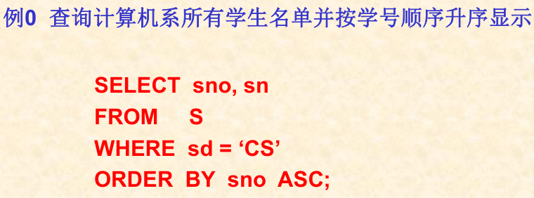{:height 211, :width 542}
					-
			- 例
				- 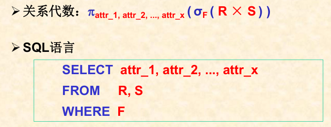{:height 209, :width 529}
				- 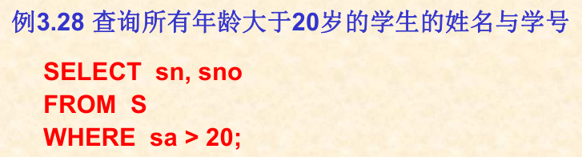{:height 155, :width 533}
				- 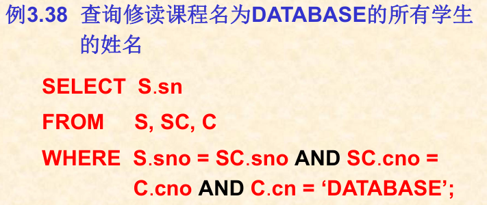{:height 234, :width 534}
				  collapsed:: true
					- 也就是先自然联结再选出DATABASE
				- 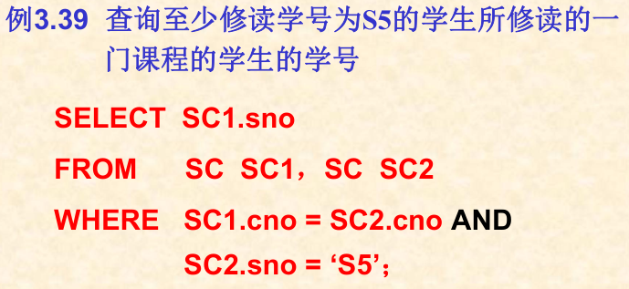{:height 254, :width 533}
				-
		- 比较谓词
		  collapsed:: true
			- 可以用在WHERE中
			- [NOT] BETWEEN ... AND ...
				- 值在两者之间；两者都包含
				- 例子
					- 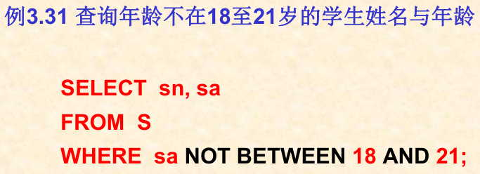{:height 200, :width 513}
			- [NOT] LIKE
				- 使用：column [NOT] LIKE val1 [ESCAPE val2]
				- 低配版正则，用来匹配字符串**（字符串记得加单引号）**
				- 模式(pattern) val1
					- 下划线(_)：匹配任意一个字符
					- 百分号(%)：匹配任意一个字符串，包括空串
				- 转义指示字符 val2
					- 紧跟在val2后的下划线/百分号表示对应字符本身，而不再是通配符
				- 例子
					- 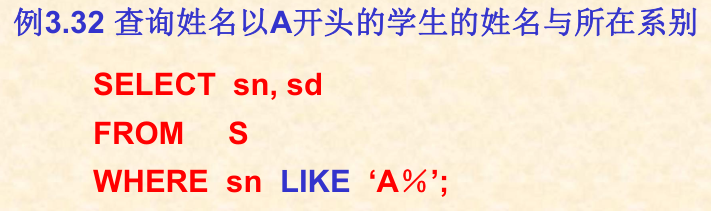{:height 159, :width 517}
					- 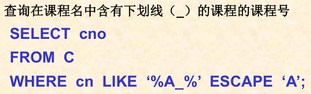{:height 159, :width 514}
			- IS [NOT] NULL
				- 据说直接写"column = NULL"再某些数据库里会出错
				- 但是这个语句却都是支持的
		- 分层查询 / 嵌套查询
		  collapsed:: true
			- 可以把在WHERE中嵌入SELECT
			- 可行的操作有：
				- expr [NOT] IN (subquery)
				- expr \theta SOME|ANY|ALL (subquery)
					- “比集合中的某些/任何/所有值都要\theta”；SOME似乎与ANY同义
					- 当然，\theta还是取那几个比较符号
					- 例如，233 < ALL (subquery)
				- [NOT] EXISTS (subquery)
			- 独立子查询
				- 有些子查询只需要进行一次，与外层无关，称为独立子查询
				- 如果子查询调用了外层的表的数据，则成为相关子查询
				- 独立子查询的查询顺序是由内而外，因为里面只需要做一次
				- 相关子查询由外到内，退化成两层循环。
			- 例子
				- 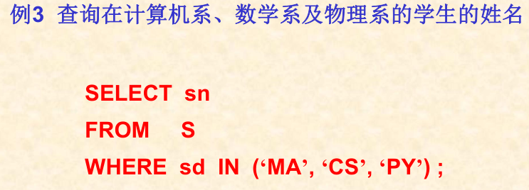{:height 187, :width 512}
				- 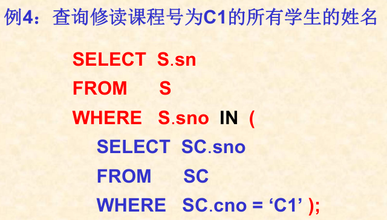{:height 299, :width 512}
				  collapsed:: true
					- 这个也可以用联接做。
				- 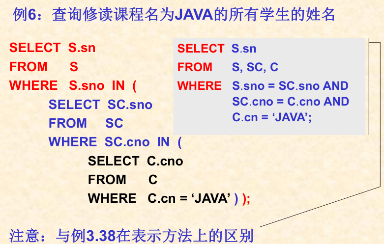{:height 365, :width 509}
				- 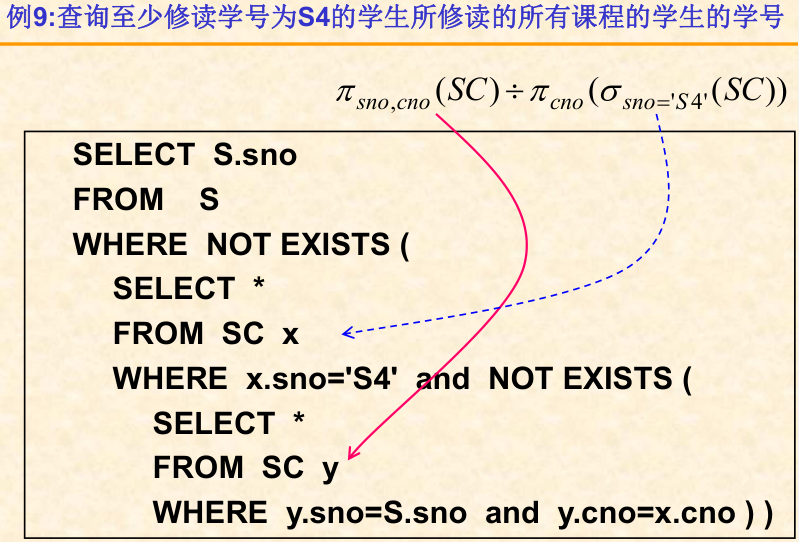{:height 319, :width 508}
				  collapsed:: true
					- Hard
				- 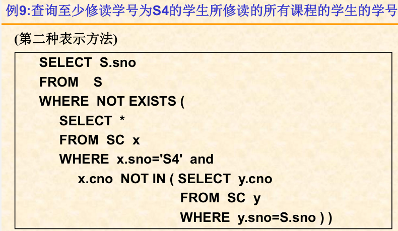{:height 350, :width 508}
		- 子查询间的运算
		  collapsed:: true
			- <子查询1> OPERATOR [ALL] <子查询2>
			- OPERATOR：可选择并交差，UNION / INTERSECT / EXCEPT
			- ALL：不去重
			- 例子
				- 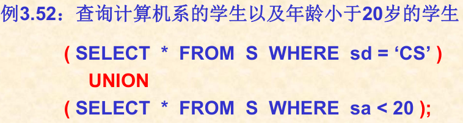{:height 162, :width 534}
				- 关于上面那个S4-hard问题的骚操作
					- 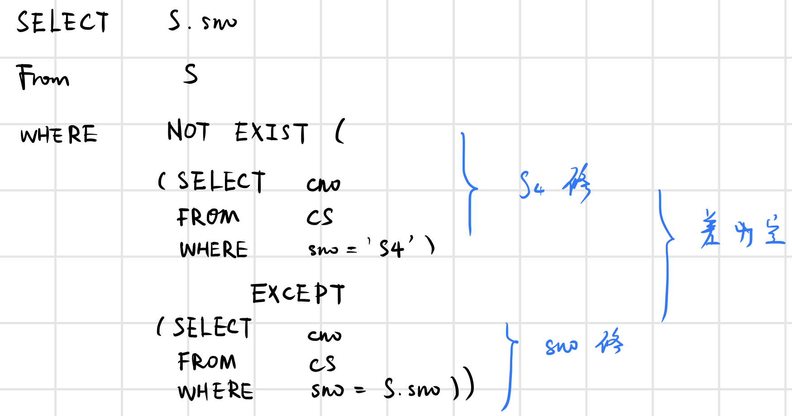{:height 299, :width 535}
	- 统计功能
	  collapsed:: true
		- COUNT
			- COUNT(*) 返回元组个数
			- COUNT(col_name) 返回该列非空元素个数
			- COUNT(distinct col_name) 返回该列非空且互不相等元素个数
			- 如果全为空值，返回0
		- SUM, AVG, MAX, MIN
			- 统计所有元组在某列上的值的总和、平均、最大、最小
			- 忽略空值；如果全为空值，返回空值（NULL）
		- **只有在SELECT与HAVING中可以使用**
		- 如果想在WHERE中使用，应当用ALL (SELECT ...)的嵌套
			- 如果能确定子查询中只有一条，也可以省去ALL
			- （不要作死冒这个险；不如别省）
		- 例子
		  collapsed:: true
			- 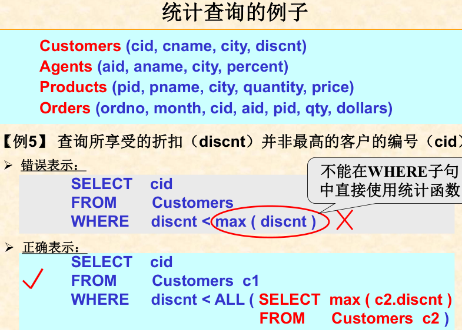{:height 389, :width 529}
			- 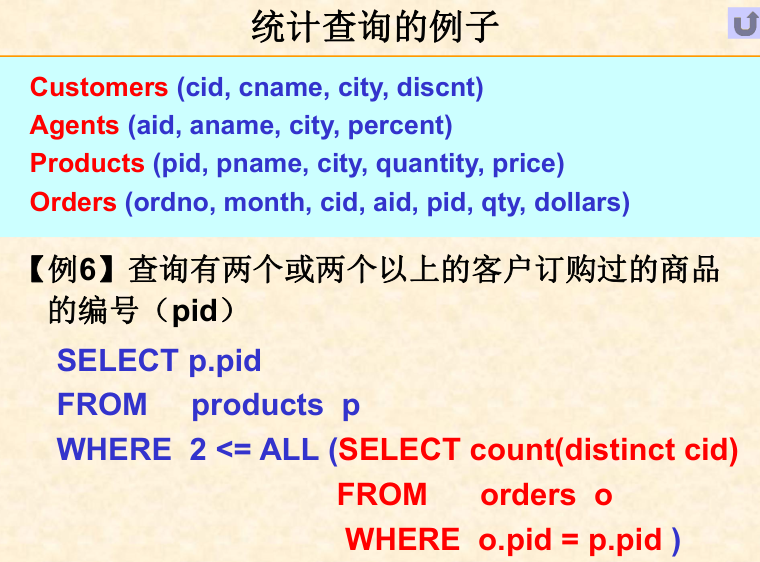{:height 433, :width 526}
			-
	- 分组查询
	  collapsed:: true
		- 难说，直接看例子罢
		- 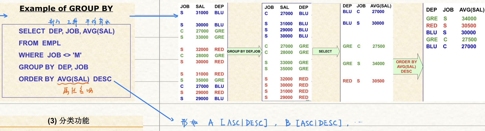{:height 208, :width 719}
		- **GROUP BY的属性一定要全部出现在SELECT中，否则非法**
			- 因此SELECT = GROUP BY + 统计结果
			- 也就是分组，然后统计
		- GROUP BY后，每个group被统计函数视作单独的表
		- GROUP BY会自动分组，依次按照给入的列名为第一二三关键字、升序
			- 我劝你还是老实写ORDER BY（笑）
	- 模拟关系代数除法
	  collapsed:: true
		- 蛮难说的
		- 总之，最外层枚举所有的想要的对象A，内一层枚举除数的元组，最内层枚举被除数的元组
		- 内层试图找到一个除数的元组B，使得(A,B)不在被除数中
		- 最内层则试图证明(A, B)在被除数中
		- 如果对内层给的所有B，最内层成功证明了(A, B)在被除数中，则内层失败，外层得到了值
		- 内层的寻找也可以用NOT IN做；最内层列出所有可行的B，内层希望B不在这堆玩意中
		- 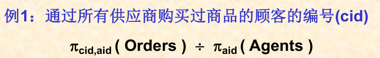{:height 86, :width 465}
		- 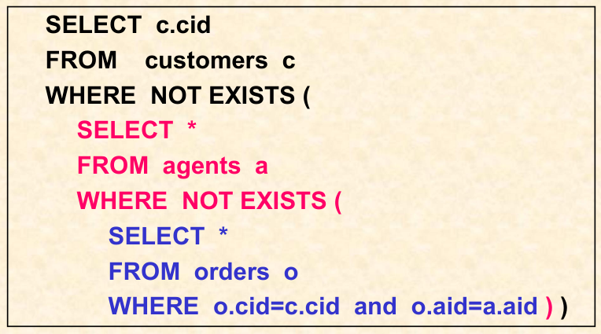{:height 289, :width 461}
		- 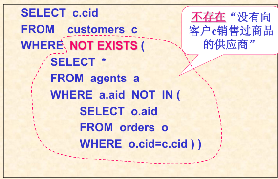{:height 324, :width 458}
	- 元组删除、插入、修改
	  collapsed:: true
		- 这个可能不是重点，也可能不是考点；但是也比较简单
		- 删除
			- DELETE FROM table_name
			  [WHERE search_condition]
			- 删除满足条件的所有元组；省略WHERE就删除所有元组（不是删除表）
			- WHERE里可以塞入子查询
			- 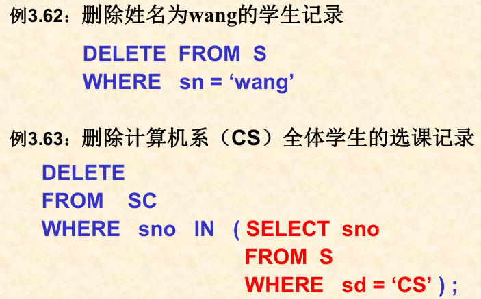{:height 312, :width 489}
		- 插入
			- INSERT INTO table_name [(colname, colname, ...)]
			  VALUES (expr | NULL, expr | NULL, ...)
			  | SUBQUERY
			- 第一行指明表的属性顺序；若不填则按定义表时的顺序
			- 第二行给入的VALUES需要与第一行一致
			- 如果使用SUBQUERY而非第二行，则将子查询的结果插入表中
			- 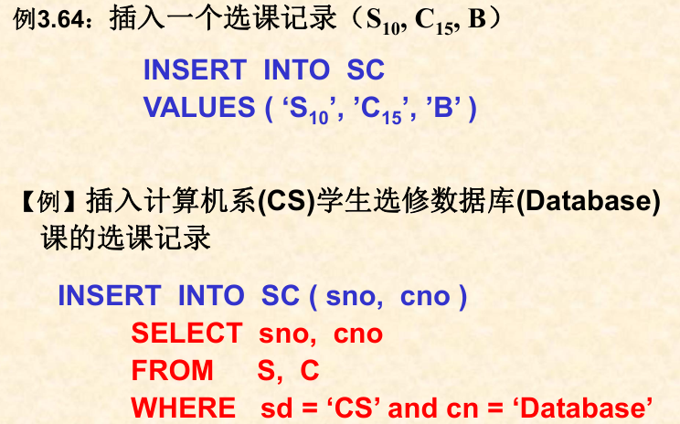{:height 104, :width 468}
		- 修改
			- UPDATE table_name
			  SET colname = expr | NULL | subquery, ...
			  [WHERE search_condition]
			- 如果使用subquery，只能返回一个元组
			- 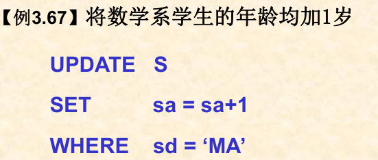{:height 197, :width 467}
			- 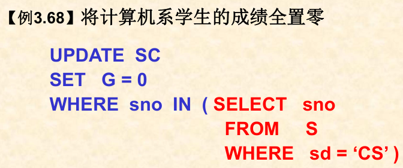{:height 207, :width 463}
			-
	- 视图（view）
	  collapsed:: true
		- 又是不知道考不考的东西？
		- 视图就是“只看你想看的”，from certain point of "view"
		- 创建
			- CREATE VIEW view_name [(col_name, ...)]
			  AS <映像语句> [WITH CHECK OPTION]
			- <映像语句>就是SELECT那些，上面见了一大堆的那种。
			- 如果写了"WITH CHECK OPTION"，则在视图上执行更新时，结果必须仍在视图里
				- 也就是结果不能让视图中的某一元组不见了，**除非是明确的删除**
		- 删除
			- DROP VIEW view_name
			- 如果创建了基于视图A的视图B，删除视图A也会删除视图B
		- 视图操作
			- 仅当满足如下条件时，视图可以执行更新操作
				- 1. 视图的每一行唯一对应了基表的每一行
				- 2. 视图的每一列唯一对应了基表的每一列
			- 这样的视图称为可更新视图(updatable view)
			- 更新操作将会被对应到基表上
		- 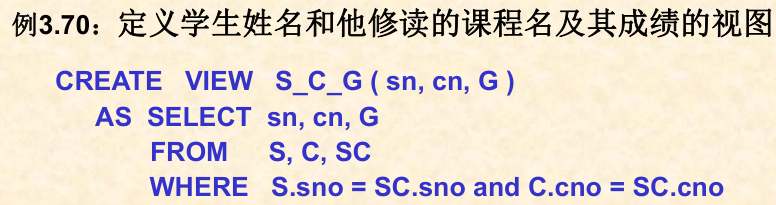{:height 141, :width 479}
		- 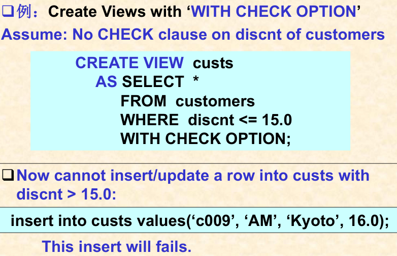{:height 333, :width 477}
		- 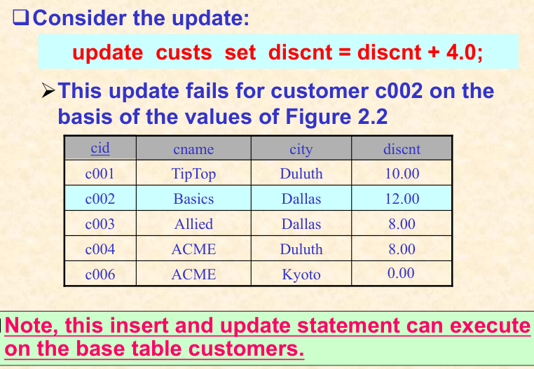{:height 338, :width 472}
		  collapsed:: true
			- 这一操作会让12+4>15，从而导致一行跑出视图外，因此被拒绝。
- 规范化设计理论
	- 函数依赖
		- 定义
			- 给定关系$R$； $X$, $Y$为$R$的两个属性子集。
			- 若对$R$中任意两个元组，在$X$上取值相同$\implies$在$Y$上取值相同
			- 则称"$X$函数决定于$Y$"，"$Y$函数依赖于$X$"；$X$为决定因素，$Y$为依赖因素。
			- 记作$X\to Y$。
		- 平凡函数依赖
			- 若$Y\subseteq X$，则$X\to Y$是平凡的。
			- 否则，$X\to Y$是非平凡的。
			- （需要能决定自身之外的事务，才是非平凡。）
		- 完全函数依赖
			- 若$X\to Y$，且$\forall X_0\subset X$均有$X_0\not\to Y$
			- 则称$Y$完全依赖于$X$，记$X\overset{f}{\to} Y$.
			- （恰好完全决定。为什么不叫极小函数依赖呢？）
		- 部分函数依赖
			- 即“非完全函数依赖的函数依赖”，记作$X\overset{p}{\to} Y$.
			- 也就是$X\to Y$但$X\not\overset{f}{\to} Y$.
			- （“部分”相对于“完全”而言）
		- 传递函数依赖
			- 满足
				- $X\to Y$
				- $Y\nsubseteq X$
				- **$Y\not\to X$**
				- $Y\to Z$
			- 则称$Z$间接依赖于$X$；这是相对于直接依赖而言的。
			- 也记作$X\to Z$.
		- 多值依赖
			- 若$X$的一个值，可对应到$Y$的一组值，且$Y$的这组值与其他属性无关
			- 则称$Y$多值依赖于$X$，记作$X\to\to Y$.
			- （能决定一部分，但是精确不到唯一值）
				- 例如$X=\{\text{种类}\}$, $Y=\{\text{名称}\}$；则$Y$多值依赖于$X$
				- 因为如果"种类"属性是"水果"，"名称"属性就不能是"篮球"
				- 这个例子在仅有两个属性时说的；若还有一个属性"形状"，则$Y$不多值依赖于$X$，因为"形状"也能（进一步）限制$Y$的取值。
	- Armstrong公理系统
		- 这是在只考虑最基础的那个函数依赖时说的。
		- 当这家伙写下"$\to$"的时候，他当然想说的是数理逻辑里那个"蕴含"。
		- 规则
			- 基本规则
				- 自反：$Y\subseteq X\implies X\to Y$
				- 增广：$X\to Y\implies XZ\to YZ$
				- 传递：$X\to Y,Y\to Z \implies X\to Z$
			- 扩充规则
				- 分解：$X\to YZ\implies X\to Y, X\to Z$
				- 合并：$X\to Y, X\to Z\implies X\to YZ$
				- 伪传递：$X\to Y, WY\to Z\implies WX\to Z$
		- 依赖集闭包
			- 设$F$是一个依赖的集合，也就是由一堆"X\to Y"组成的集合。
			- 则记$F\models X\to Y$，倘若$X\to Y$可以经由规则，从$F$中的依赖推导而出。
			- 则记$F^+ =\{X\to Y: F\models X\to Y\}$
		- 属性集闭包
			- 设$X\subseteq Head(R)$是一个属性集合。
			- 则$X_F^+=\{A | F\models X\to A\}$。
				- 也就是所有被$X$决定的属性都包括进来了。
				- 也就是$X$不能再决定自身之外的任何属性了。
			- 主属性集
				- 由所有关键字中的属性构成的集合
				- 也就是$\{T\in Head(R): \exists X\subseteq R\ s.t.\ T\in X\wedge X\overset{f}{\to}Head(R)\}$
				- 也就是$\bigcup_{X\overset{f}{\to}Head(R)}X$
				- 一个属性是主属性，意味着它是对整体有决定作用的
					- 也就是$Head(R)$完全依赖于某个集合$X$
					- 而它恰好是这个$X$中（不可缺少，因为是完全的）的一员。
	- 范式
		- 模式分解
			- 对关系模式$R$，记其所有属性集为$Head(R)$。
			- 若有子关系模式$R_1, ..., R_k$，使得：
				- 1. $Head(R) = \cup Head(R_i)$；不要求（也无法要求）是不交并
				- 2. 设$R_i$上的函数依赖集为$F_i$
				      则$F_i=\{X\to Y\ |\ X\to Y\in F^+\wedge (X\cup Y)\subseteq Head(R)\}$
			- 则称这一些子关系模式为对关系模式$R$的一个模式分解。
			- 条件2 的意思是“把原来的关系模式投影到子关系模式上”
		- 第一范式
			- 定义
				- 若关系模式$R(U)$中，每个属性都是不可分割的数据量
				- 则称它满足第一范式，记作$R(U)\in 1NF$.
			- 这是关系模型的基础；每一个关系都必须满足
			- 所谓“不可分割”，指的是每个属性是原子的，不可以给它的“某一部分”赋值。
		- 第二范式
			- 定义
				- 设$R(U)\in 1NF$，且每个非主属性均完全依赖于关键字
				- 则称它满足第二范式，记作$R(U)\in 2NF$.
			- 含义
				- 那些不可能构成关键字的属性完全依赖于关键字。
				- 关键字不仅决定了它们，而且是“正好”决定，没有冗余。
			- What to do
				- 如果一个非主属性部分完全依赖于关键字的真子集，它应该和这部分拉出去单独建表。
				- 也就是如果$Y\overset{f}{\to} t$，且$Y\subset X$（真子集）
				- 则$Y$和$t$应该单独拉出去建表，而不是等着把$X$说完了再说一遍$t$.
			- 模式分解
				- 可以通过模式分解将不满足第二范式的模式分解到满足若干第二范式的子关系模式。
		- 第三范式
			- 定义
				- $R(U)\in 2NF$，且非主属性不传递依赖于关键字
			- 含义
				- 在第二关键字非主属性完全依赖于关键字的同时
				- 要求非主属性是直接依赖于关键字的，不能是推导几步后得到的
				- 因此如果非主属性为空，则直接满足第三范式
			- 定理
				- 内容
					- 不满足第三范式，当且仅当有一个非主属性完全依赖于某个非关键字属性集
					- 注意需要完全依赖
				- 证明
					- 充分性
						- 若其不满足第二范式，则有非主属性非完全地依赖于关键字，易证。
						- 若其满足第二范式，则有非主属性传递依赖于某个关键字
						- 不妨记为$X\overset{f}{\to} Y\to t$，且$Y\not\to X$（传递依赖要求）
						- 则$Y$一定是非关键字。
						- 在$Y$中取子集使得$t$完全依赖于该子集；证毕。
					- 必要性
						- 若有非主属性$t$完全依赖于非关键字属性$Y$。取最小的这样的$Y$。
						- 假设满足第三范式，则满足第二范式，则任何关键字$X$，有$X\overset{f}{\to} Y$.
						- 则$X\overset{f}{\to} Y\to X$.
						- 同时，由于$Y$是最小的这样的非关键字
						-
			- What to do: 满足第二范式而不满足第三范式
				- 如果非主属性$t$传递依赖于关键字$X$.
				- 假设$X\overset{f}{\to} Y\overset{f}{\to} t$
				- 则$Y$应该和$t$拉出去单独建表，而不是在$X$已经能决定$Y$后还要罗嗦一遍$t$.
		- 巴斯-科德范式 (Boyce-Codd Norm Form)
			- 定义
				- 设$R(U)\in 1NF$
				- 若每个函数依赖$X\to Y(Y\nsubseteq X)$，$X$都含$R$的关键字
				- 则称其满足BC范式，记$R(U)\in BFNF$.
			- 含义
				- 只有关键字能决定非自己的某些部分
			- 定理
				- 内容
					- $R(U)\in BCNF\implies R(U)\in 3NF$.
				- 证明
					- 根据定义，若$X\overset{f}{\to}Y$是非平凡的，则$X$一定为关键字。
					- 因此易见$R(U)\in 2NF$
					-
		- 第四范式
-