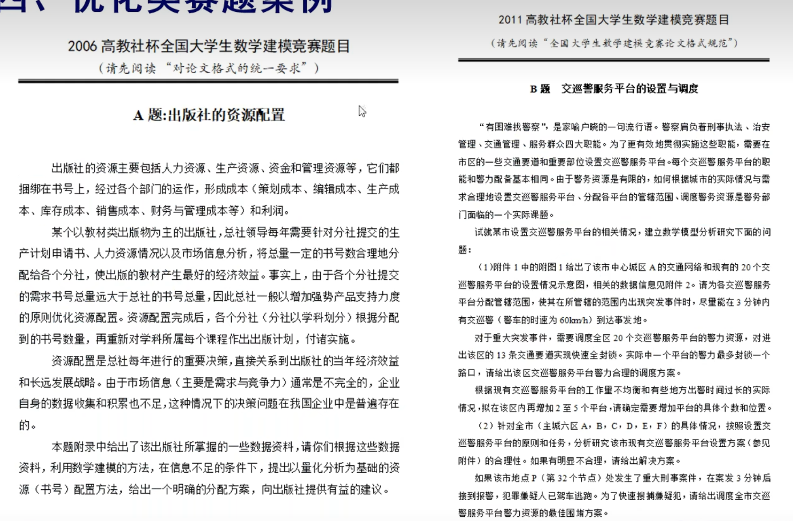

public:: true

- 准备数学建模比赛ing
- 赛题类型
  collapsed:: true
	- 预测类
	  collapsed:: true
		- 
		- 
		-
	- 评价类
	  collapsed:: true
		- 
		- 
		-
	- 机理分析类
	  collapsed:: true
		- 
		- 
		-
	- 优化类
	  collapsed:: true
		- 
		- 
	- 这样来看，优化类问题最对我胃口。祈祷吧。
- 整数线性规划
	- 分支定界法
	- 割平面法[[Cutting-plane Method]]